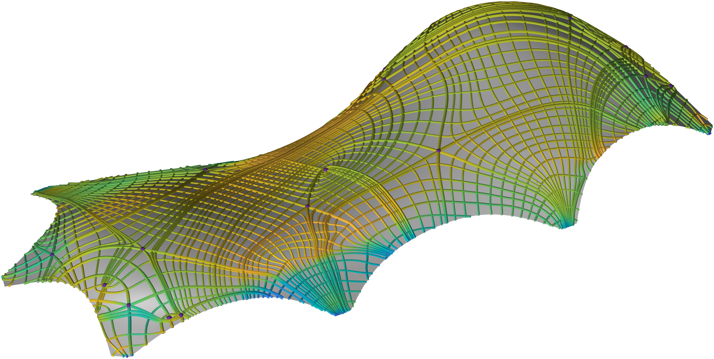

# PSLshell

<p align="center">
  
</p>

Topology-aware principal stress line tracing on shell structures.

**PSLshell** is a MATLAB implementation for tracing and visualizing principal stress lines (PSLs) on shell structures.

It accompanies the paper:

> Junpeng Wang, Yingjian Liu, Jun Wu, and Rüdiger Westermann  
> *Topology-aware Stress Analysis in Shell Structures*  
> Computer Methods in Applied Mechanics and Engineering, 2026

---

## Overview

PSLshell performs topology-aware stress analysis on shell meshes and extracts:

- Major and minor principal stress lines (PSLs)
- Degenerate points of the stress field
- Topological skeleton structures

The method operates directly on FEM stress fields and supports mixed shell meshes.

---

## Features

- Principal stress line tracing on shell surfaces  
- Supports shell elements:
  - T3 / Q4 / T6 / Q8  
- Works with triangular, quadrilateral, and hybrid meshes  
- Handles node-wise or element-wise stress data  
- Topology-aware PSL seeding and distribution control  
- Detection of degenerate points and skeleton extraction  
- Lightweight `.TSV` interface for FEM data  
- Single-file MATLAB implementation (`PSLshell.m`)  

---

## Input Data

PSLshell reads stress fields from a `.TSV` file, which contains:

- Mesh vertices  
- Element connectivity  
- Boundary condition Info (optional)
- Stress tensor components  

The stress tensor can be defined in:

- Local shell coordinates, or  
- Global Cartesian coordinates  

---

## Quick Start

Run in MATLAB:

```matlab
PSLshell
```

## Key Parameters

- **PSLsDensityCtrl**  
  Controls PSL density (larger → denser lines)

- **PSLtypeCtrl = [major, minor]**  
  0 = generate, 1 = skip

- **topologyAware**  
  Enable topology-aware PSL tracing

- **distanceMetric**  
  'Euclidean' or 'Geodesic'

- **seedSparsityCtrl**  
  Controls seed sampling density

- **maxIts**  
  Maximum integration steps per PSL
  
## Output

PSLshell generates:

- Major PSLs  
- Minor PSLs  
- Degenerate points  
- Topological skeletons  

## Citation
```bibtex
If you use this code, please cite:
@article{wang2026topology,
  title={Topology-aware stress analysis in shell structures},
  author={Wang, Junpeng and Liu, Yingjian and Wu, Jun and Westermann, R{\"u}diger},
  journal={Computer Methods in Applied Mechanics and Engineering},
  volume={452},
  pages={118770},
  year={2026},
  publisher={Elsevier}
}
```

## Author
Junpeng Wang  
Technical University of Munich  
junpeng.wang@tum.de